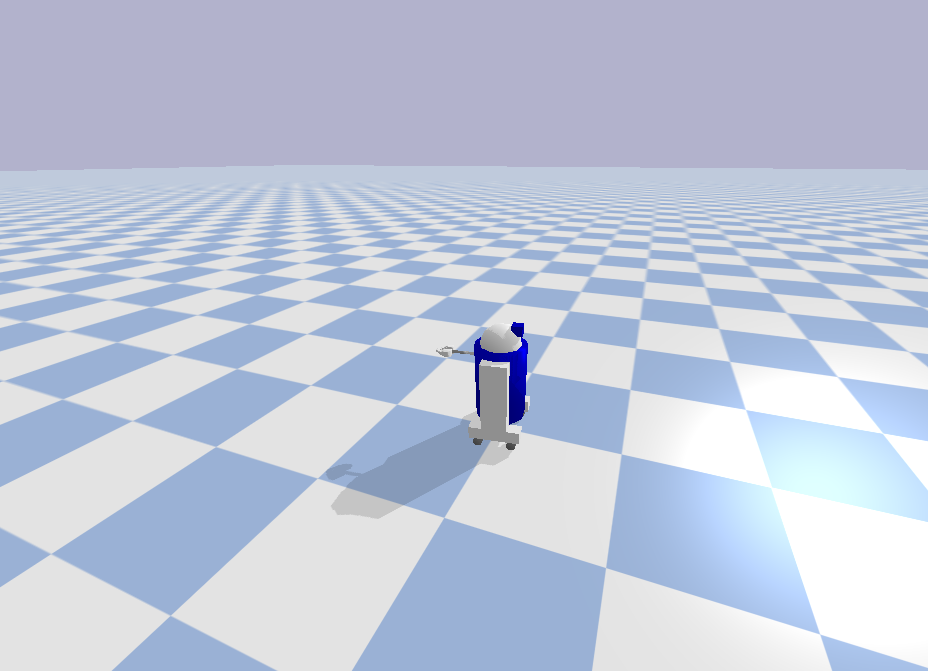
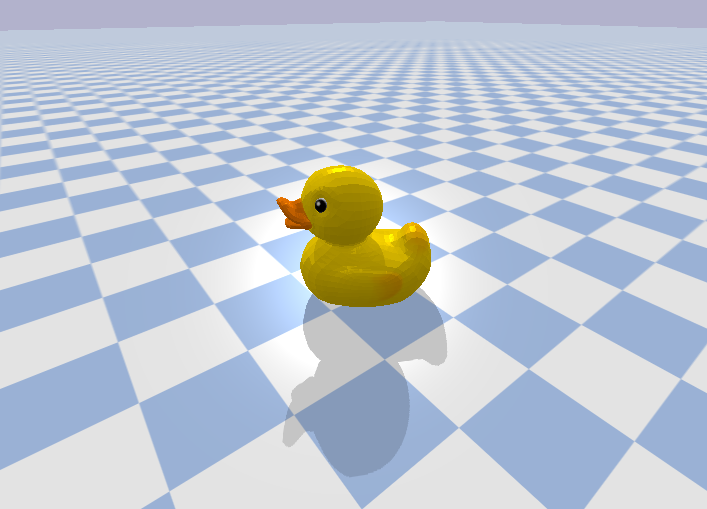
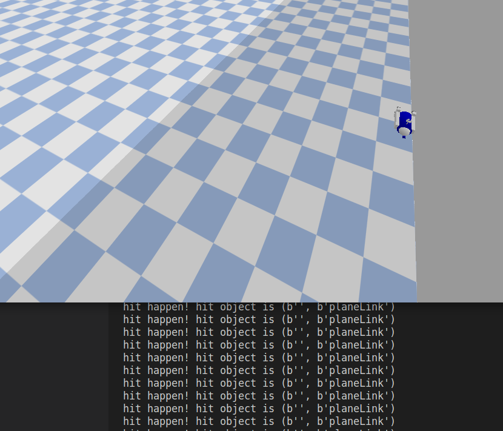
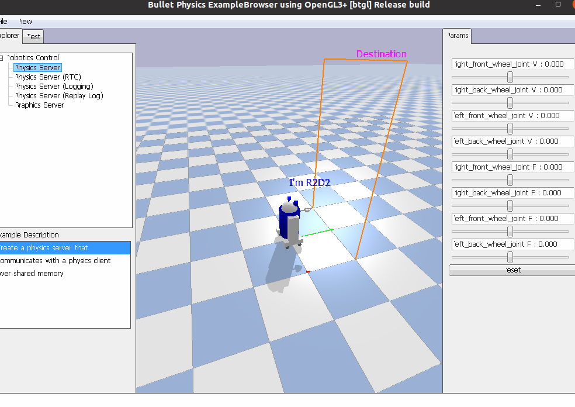

# Pybullet+gym+pytorch+stable baselines 学习笔记
**最后更新于 2023年2月11日**

## 1. pybullet官方说明pdf文档

https://usermanual.wiki/Document/pybullet20quickstart20guide.479068914.pdf

##  2. linux环境
- **环境：conda虚拟环境 python3.9**
- **创建虚拟环境**
    ` conda create -n my_pybulletLearning python=3.9 `
    ` conda activate my_pybulletLearning`
    更新pip
    ` pip install --upgrade pip`
    更换清华源
    ` pip config set global.index-url https://pypi.tuna.tsinghua.edu.cn/simple`
- **安装pybullet及其他需要的包**
    ` pip install pybullet`
    ` pip install numpy==1.19.3` 
    ` pip install gym==0.20.0` 
    ` pip install ipdb`  #不知道是什么东西
- **安装tensorflow**
    ` pip install tensorflow`
    我这里发生报错 INTEL MKL ERROR... ，通过以下解决：
    ` pip install nomkl`

##  3. windows环境
- **环境：conda虚拟环境 python3.9**
- **创建虚拟环境**
    windows下使用conda的配置更复杂一些，需要配置环境变量。百度即可。
    同时记得百度一下怎么将虚拟环境的默认安装地址从c盘改到其他盘。
    ` conda create -n my_pybulletLearning python=3.9 `
    ` conda activate my_pybulletLearning`
    更新pip
    ` conda install pip`
    ` pip install --upgrade pip`
    更换清华源
    ` pip config set global.index-url https://pypi.tuna.tsinghua.edu.cn/simple`
- 安装pybullet及其他包
    ` conda install pybullet`
    ` conda install gym=0.20.0`
    ` conda install pyglet`

##  4. 一些pybullet例程
- **鼠标互动足球**
    ` python -m pybullet_examples.soccerball`
- **一个简单的双足机器人模型**
    ` python -m pybullet_examples.biped2d_pybullet`
- **bipedal-robot-walking-simulation-master**
  一个简单的控制双足机器人行走的例程。自行设计简单步态，根据步态完成各个关节轨迹规划，PD控制驱动关节。
- **robotCheckTest**
  有关机器人信息的查询函数。
- **robotControlTest**
  机器人控制测试。r2d2机器人。
  
- **duckTest**
  通过3d文件生成碰撞体测试。自带的小黄鸭模型。
  
- **collisionTest**
  AABB包围箱，碰撞测试。
  
- **debugTest**
  在GUI上添加交互按钮，添加说明文字等。
  

##  5. gym
**gym版本目前暂时选用0.21.0，发布于2021年10月。**  

目前最新版本的gym为0.26.2，相比于0.21.0更改了许多关键API，新旧版本并不兼容。

` pip install gym==0.21.0 `     

安装完成后测试一下来自pybullet的官方例程，能看到一个踉跄奔跑的小人。  

` python -m pybullet_envs.examples.enjoy_TF_HumanoidBulletEnv_v0_2017may`     

打印gym所有可用env：

```python
from gym import envs
for env in envs.registry.all():
    print(env.id)
```
一个适用于gym 0.21.0版本的例程：

```python
import gym
print(gym.__version__)
env = gym.make('CartPole-v1')  #倒立摆
env.reset()
for _ in range(10000):
    env.render()                            # 渲染
    act = env.action_space.sample()         # 在动作空间中随机采样
    obs, reward, done, _ = env.step(act)    # 与环境交互
    if done:
        env.reset()
env.close()	
```

gym的一些例程：

- **gymTest0**
  gym 测试，生成一个倒立摆
- **gymTest1**
  尝试通过pybullet引入gym环境，生成一个倒立摆
- **[CSDN] gym搭建自己的环境，全网最详细版本，3分钟你就学会了！**
https://blog.csdn.net/sinat_39620217/article/details/115519622

### 安装mujoco

在win11系统下安装mujoco。

报错Path时，进入报错的builder.py文件，在76行下面添加   

` os.environ[var]+=";"+lib_path`

##  6. stable_baselines
安装stablebaselines3，同时安装pyrender用于图像展示。
` conda install stable_baselines3`
` conda install pyrender` 
或者从conda安装，可能有点慢
` conda install -c conda-forge stable-baselines3`

或直接pip安装，记得在anaconda prompt里使用pip

` pip install stable-baselines3==1.5.0`

**版本暂时选用1.5.0，该版本要求gym>=0.21.0。**

什么是stable_baselines？
基于pytorch的深度强化学习工具包，可直接联合gym，对gym的env环境进行训练。

- Stable Baselines3 (SB3) is a set of reliable implementations of reinforcement learning algorithms in PyTorch. It is the next major version of Stable Baselines.
- [stable_baselines官方文档](https://stable-baselines3.readthedocs.io/en/master/index.html)
- 【CSDN】一篇比较详细的介绍gym和stable baselines3的文档
  [强化学习之stable_baseline3详细说明和各项功能的使用](https://blog.csdn.net/tianjuewudi/article/details/123113885)

### **来自pybullet官方文档的例程**

- pybullet官方文档里提供了使用stable_baselines的例程。  
  ` pip3 install stable_baselines --user`
  训练一个HalfCheetah（半拉猎豹）智能体：
  ` python -m pybullet_envs.stable_baselines.train --algo sac --env HalfCheetahBulletEnv-v0`
  有可能会报错，需要再手动安装stable_baselines3
  ` pip3 install stable_baselines3`
  默认迭代次数为1e6，我花了二十分钟才跑了十分之一，直接ctrl+C中断了。中断后会自动保存训练好的参数，训练参数结果会保存在环境同名文件夹下（sac_HalfCheetahBulletEnv-v0）。
- 通过pybullet_envs/stable_baselines文件夹下的enjoy.py文件来查看训练结果。我训练了20分钟，十一万次迭代，效果比较差，猎豹智能体基本站不起来。
  ` python -m pybullet_envs.stable_baselines.enjoy --algo sac --env HalfCheetahBulletEnv-v0 --n-episodes 5`
- **尝试训练新的环境**
    训练gym中HumanoidBulletEnv-v0的环境
    ` python -m pybullet_envs.stable_baselines.train --algo sac --env HumanoidBulletEnv-v0`
    ` python -m pybullet_envs.stable_baselines.enjoy --algo sac --env HumanoidBulletEnv-v0 --n-episodes 5`  
    在调试的.json文件中添加args：
    ` "args": ["--algo", "sac", "--env", "HumanoidBulletEnv-v0"],`    

### 一些测试用例

- **来自官方文档**  

  使用A2C训练倒立摆

  ```python
  import gym
  
  from stable_baselines3 import A2C
  
  env = gym.make("CartPole-v1")  #调用env
  
  model = A2C("MlpPolicy", env, verbose=1)  #定义policy
  model.learn(total_timesteps=10_000)       #训练，timesteps=10000
  
  vec_env = model.get_env()
  obs = vec_env.reset()
  for i in range(1000):
      action, _state = model.predict(obs, deterministic=True)
      obs, reward, done, info = vec_env.step(action)
      vec_env.render()
      # VecEnv resets automatically
      # if done:
      #   obs = vec_env.reset()
  ```

  或者，只用一行代码来训练已经注册好的模型：

  ```python
  from stable_baselines3 import A2C
  
  model = A2C("MlpPolicy", "CartPole-v1").learn(10000)
  ```

  


##  7. GPU加速pytorch
为了使用GPU加速的pytorch，单独创建一个虚拟环境。  

` conda create -n torch_gpu python=3.9`
` conda activate python=3.9`  

重新安装相关包：
` conda install pybullet`
` conda install gym=0.21.0`
` conda insatll pyglet`
` conda install stable-baselines3`  

安装不上时可以试试    

` conda install -c conda-forge stable-baselines3`
` conda install pyrender`
GPU加速pytorch安装步骤：
[pytorch gpu版本的最全安装教程，含环境配置、CUDA（百度云下载）安装程序失败解决方案](https://blog.csdn.net/L1778586311/article/details/112425993)
安装pytorch时参考下文，否则很容易用conda的镜像安装成cpu版本：
[torch.cuda.is_available()返回false——解决办法](https://blog.csdn.net/qq_46126258/article/details/112708781)    
CUDA11.6对应版本的pytorch安装：
` pip install torch==1.12.1+cu116 torchvision==0.13.1+cu116 torchaudio==0.12.1 --extra-index-url https://download.pytorch.org/whl/cu116`
安装完pytorch后，在命令行输入：

```shell
python
import torch
print(torch.__version__)
```
如果运行结果为` 1.7.1+cpu`或其他cpu版本，立刻从头再来...
安装完CUDA并配置好环境变量后，命令行输入：

```shell
python
import torch
torch.cuda.is_available()
```
如果结果为`True`，则安装完成。
运行测试用例`python learning/sb3Test0.py`,可以看到第一行打印为：
`Using cuda device`


##  8. pybullet一些常用API：
```python
import pybullet as p
```
- 连接物理引擎  GUI：带可视化界面   DIRECT：不带可视化界面，直接连接物理引擎
`physicsClient = p.connect(p.GUI)`
- 添加模型搜索路径
`p.setAdditionalSearchPath(pybullet_data.getDataPath()) `
- 关闭界面两侧控制窗口
` p.configureDebugVisualizer(p.COV_ENABLE_GUI, 0)  `
- 关闭/开启渲染界面
`p.configureDebugVisualizer(p.COV_ENABLE_RENDERING, 0) `
- 设置重力
`p.setGravity(0,0,-10)`
- 加载机器人 参数：filename, base position, base orientation, useMaximalCoordinates(选用后会提升仿真速度), use fixed base, flags(详见pdf), global scaling, physics client ID
  ` boxId = p.loadURDF("r2d2.urdf",cubeStartPos, cubeStartOrientation)`
- 获取机器人关节数目，返回关节数目的int值
  ` p.getNumJoints(robot, physicsClientId=physicsClientId)`
- 获取关节信息 
  `  jointInfo = p.getJointInfo(self._robot, i, physicsClientId=self._physicsClientId)`